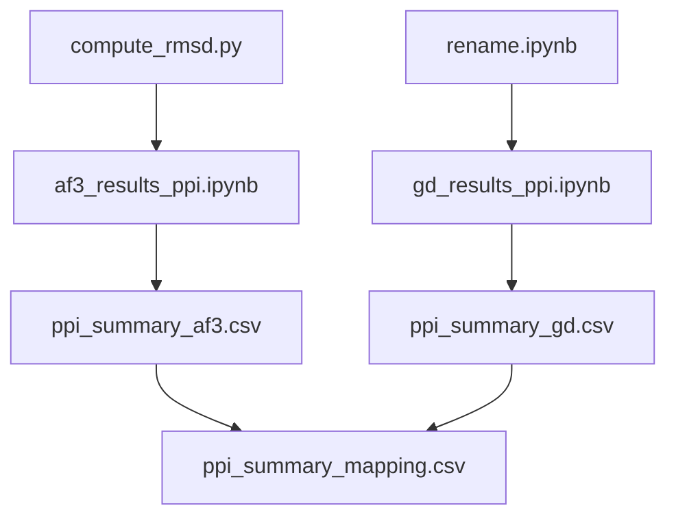

# Epitope
# 🧬 IL-23 Antibody–Antigen Interaction Analysis Pipeline

本项目用于对 **AlphaFold3 (AF3)** 预测的抗体–抗原复合物结构进行 **质量评估、相互作用分析与结果映射**，并与实验结构 (ground truth) 进行系统对比。  
适用于基于 **PPI 计算 + RMSD 分析** 的抗体预测模型验证与性能评估。

---

## 📁 项目结构

```
IL23-ppi-analysis/
├── rename.ipynb                   # 实验结构链标准化与命名修复
├── compute_rmsd.py                # 计算 AF3 模型与实验结构的 VH/VL RMSD
├── gd_results_ppi.ipynb           # 实验结构 (ground truth) PPI 计算
├── af3_results_ppi.ipynb          # AF3 预测结构 PPI 计算与映射
├── pdb_to_af3_mapping.csv         # 残基索引映射表（AF3 → 实验结构）
├── /data/IL23/
│   ├── 5njd.pdb                   # 实验结构 (ground truth)
│   ├── cif/                       # AF3 预测结构 (.cif)
│   ├── cif_pdb/                   # 筛选后转换为 PDB 的文件
│   ├── processed_cif_pdb/         # 为 PPI 计算准备的结构 (双链 A/B)
│   ├── processed_groundtruth/     # 处理后的实验结构
│   ├── ppi_csv/                   # AF3 模型的 PPI 结果
│   ├── ppi_csv_gd/                # 实验结构的 PPI 结果
│   ├── ppi_summary_af3.csv        # AF3 汇总结合位点
│   ├── ppi_summary_gd.csv         # 实验结构汇总结合位点
│   ├── ppi_summary_mapping.csv    # AF3 位点映射至实验结构
│   └── VHVL_RMSD_results.csv      # 各模型 RMSD 结果
└── README.md                      # 本说明文件
```

---

## ⚙️ 环境配置

建议使用 Conda 环境：

```bash
conda create -n ppi python=3.10
conda activate ppi

# 基础依赖
conda install -c conda-forge mdanalysis biopython pandas tqdm seaborn matplotlib joblib requests
pip install bioblocks

# 需要外部命令行工具
# 确保 ppi.analyse 可在命令行中直接运行
```

---

## 🚀 运行流程

### 🧩 Step 1. 计算 RMSD（筛选预测结构质量）
**脚本：** `compute_rmsd.py`

```bash
python compute_rmsd.py
```

输出：
- `VHVL_RMSD_results.csv`：各模型 VH+VL 的 RMSD  
- `VHVL_RMSD_dist.png`：RMSD 分布直方图  

作用：选择 RMSD ≤ 30 的结构作为后续分析对象。

---

### 🧬 Step 2. 标准化实验结构链命名
**脚本：** `rename.ipynb`

功能：
- 下载并读取实验结构（如 PDB ID: 5NJD）
- 自动识别并分类 H、L、A 链
- 重新命名链为标准形式（H/L/A）
- 输出修正后的结构

输出文件示例：
```
/home/yuyang/lb/data/IL23/5njd.pdb
```

---

### 🧠 Step 3. 计算实验结构的 PPI（Ground Truth）

**脚本：** `gd_results_ppi.ipynb`

功能：
- 将实验结构转换为双链（A-B）
- 分别计算 H_to_B_no_L 与 L_to_B_no_H 的 PPI
- 汇总所有抗原结合位点到：
  ```
  /home/yuyang/lb/data/IL23/ppi_summary_gd.csv
  ```

---

### 🤖 Step 4. 计算 AF3 预测结构的 PPI

**脚本：** `af3_results_ppi.ipynb`

功能：
1. 根据 RMSD ≤ 30 的模型，从 `.cif` 转为 `.pdb`
2. 对 PDB 文件进行链处理（生成双链结构）
3. 调用 `ppi.analyse` 计算抗原–抗体相互作用
4. 汇总结果为：
   ```
   /home/yuyang/lb/data/IL23/ppi_summary_af3.csv
   ```

---

### 🔁 Step 5. 映射 AF3 位点至实验结构编号体系

**脚本：** `af3_results_ppi.ipynb`（后半部分）

利用 `pdb_to_af3_mapping.csv`，将 AF3 的残基编号转换为实验结构的编号：
```
/home/yuyang/lb/data/IL23/ppi_summary_mapping.csv
```

该文件用于后续评估预测精度。

---

## 📊 结果说明

| 文件 | 内容 |
|------|------|
| `VHVL_RMSD_results.csv` | 每个预测模型与实验结构的 VH/VL RMSD |
| `ppi_summary_gd.csv` | 实验结构的抗原结合位点 |
| `ppi_summary_af3.csv` | AF3 预测结构的结合位点 |
| `ppi_summary_mapping.csv` | AF3 位点映射到实验结构编号体系后的结果 |

---

## 🧩 模块依赖关系



---

## 💡 输出结果可用于

- 对比 AF3 与实验结构的抗原结合位点重叠度；
- 评估 AF3 在界面残基识别层面的预测性能；
- 分析 RMSD 与结合位点预测准确率的相关性。

---

## 🧑‍🔬 引用工具

- [Bioblocks](https://pypi.org/project/bioblocks/)
- [MDAnalysis](https://www.mdanalysis.org/)
- [ANARCI](https://github.com/oxpig/ANARCI)
- `ppi.analyse` 命令行工具（自定义或外部提供）

---


